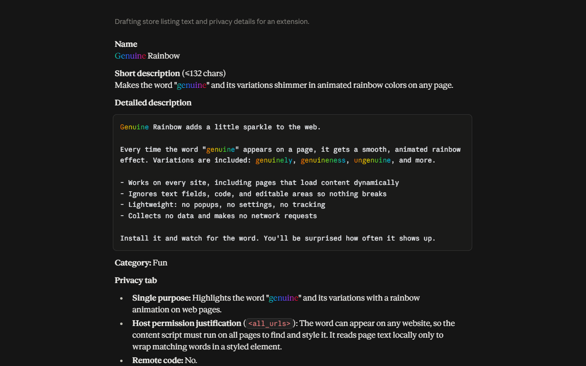

<p align="center">
  
</p>

<h1 align="center">Genuine Rainbow</h1>

<p align="center">
  A Chrome extension that makes the word <b>"genuine"</b> shimmer in animated rainbow colors.<br>
  Because once you notice how often AI says it, you can't unsee it.
</p>

<p align="center">
  
</p>

## Why?

"Genuine", "genuinely", "genuinely curious", "I genuinely think..." is a well-known verbal tic of AI assistants. This extension makes it impossible to miss: every appearance of the word lights up, on any page, including inside AI chat interfaces.

It is a small joke with a small, clean implementation.

## What it does

Finds these words (case-insensitive) and applies a smooth, looping rainbow animation:

- genuine
- genuinely
- genuineness
- ungenuine, ungenuinely

It also handles content that loads after the page does (chat responses, infinite scroll, single-page apps).

It deliberately leaves alone scripts, styles, text areas, and editable fields, so it can't break forms or page code. The animation slows down if your system is set to "reduce motion".

## Install

### From the Chrome Web Store

Pending review. The link will be added here once it's live.

### Manually (any Chromium browser: Chrome, Edge, Brave, Arc, ...)

1. Download this repo: **Code → Download ZIP**, then unzip it (or `git clone` it).
2. Open `chrome://extensions` (Edge: `edge://extensions`).
3. Turn on **Developer mode** (top right).
4. Click **Load unpacked** and select the folder that contains `manifest.json`.
5. Open any page containing the word "genuine". It should be glowing.

After editing any file, click the reload icon on the extension's card, then refresh the page.

> The extension doesn't run on browser-internal pages (`chrome://`), the Chrome Web Store, or the built-in PDF viewer. That's a Chrome restriction.

## How it works

| File | Role |
| --- | --- |
| `manifest.json` | Manifest V3 config. Injects the script and stylesheet into every page. |
| `content.js` | Walks the page's text nodes, splits them on a regex, and wraps each match in `<span class="genuine-rainbow">`. A `MutationObserver` processes content added later, batched with `requestAnimationFrame`. |
| `style.css` | Rainbow `linear-gradient` clipped to the text (`background-clip: text`), with a looping `background-position` animation. |

No background worker, no popup, no permissions beyond running on pages, no network requests.

## Customize

**Change the word.** Edit the regex at the top of `content.js`:

```js
const SPLIT = /(\b(?:un)?genuine(?:ly|ness)?\b)/i;
```

For example, `/(\b(?:delve|tapestry|testament)\b)/i` for other well-known AI tells. Keep the outer capture group; the splitting logic depends on it.

**Change the colors or speed.** Edit the gradient stops and `animation` duration in `style.css`. The gradient ends on its own first color so the loop is seamless.

## Privacy

Genuine Rainbow does not collect, store, transmit, or share any data. Everything happens locally in your browser. See [privacy.html](privacy.html).

## Project structure

```
.
├── manifest.json
├── content.js
├── style.css
├── icons/            # 16, 48, 128 px extension icons
├── assets/           # README images
├── privacy.html      # privacy policy page
└── README.md
```
